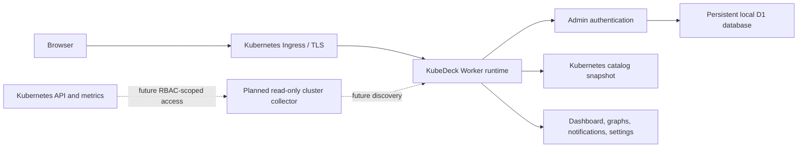

<p align="center">
  
</p>

<h1 align="center">KubeDeck</h1>

<p align="center">
  <strong>A Kubernetes-native homepage for your homelab.</strong>
</p>

<p align="center">
  One private launchpad for clusters, nodes, workloads, web interfaces,
  services, DNS names, ports, health, deployment history, and notifications.
</p>


## What is KubeDeck?

KubeDeck is a focused home dashboard for Kubernetes homelabs. It takes the
one-click service-launcher idea popularized by
[Homepage](https://gethomepage.dev/) and applies it specifically to the
Kubernetes ecosystem.

Instead of maintaining a general bookmark page, KubeDeck is designed around
the objects and operational questions that matter inside a cluster:

- Which nodes and workloads are healthy?
- Which services expose a web interface?
- What is the internal cluster DNS name?
- Which external hostname and ports should I use?
- When was the workload last deployed?
- Is the service ready, degraded, or unavailable?
- Which services belong to storage, observability, automation, AI, or another
  platform category?

KubeDeck is distribution-independent. It is intended for K3s, RKE2, Rancher,
Talos, MicroK8s, kind, managed Kubernetes, and other conformant clusters.

## Project status

KubeDeck is currently an early `v0.1` foundation.

The repository includes the complete dashboard experience, responsive
liquid-glass interface, authentication, Kubernetes-oriented catalog,
multi-node review, notifications, settings, container runtime, and Helm chart.
The catalog and node telemetry currently use explicit illustrative snapshot
data so that the interface and operating model can be evaluated safely.

Live read-only Kubernetes API discovery, metrics collection, and multi-cluster
connectors are the next integration layer. The current chart deliberately does
not grant the application access to the Kubernetes API or claim that example
status values are live.

## Highlights

- Kubernetes-only service and application homepage
- One-click access to web UIs and external routes
- Internal service DNS, ClusterIP, protocol, port, namespace, workload, and pod
  readiness details
- Intelligent catalog categories:
  - Web Applications
  - Databases & Storage
  - Observability & Metrics
  - Automation & Workflows
  - Deployments & Testing
  - AI & MCP Services
  - Messaging & Events
  - Developer Tools
  - Platform & Security
- Multi-node cluster review with CPU, memory, storage, and pod-allocation charts
- Graphical readiness, uptime, endpoint, and last-deployment indicators
- Service and node status notification center
- Search, status filters, resource-kind filters, and sorting
- Current-user, Kubernetes, application, and user-management settings
- First-admin bootstrap from a Kubernetes Secret
- PBKDF2-SHA-256 password hashing and signed, secure, HTTP-only sessions
- Responsive KubeDeck banner, live topology animation, reduced-motion support,
  and multi-size brand assets
- OCI container build and Helm deployment with persistent local D1 storage

## Interface

The dashboard is organized as an operational homepage rather than a generic
intranet portal:

1. **Cluster overview** summarizes nodes, pods, namespaces, workloads, routes,
   DNS, and current attention items.
2. **Node review** compares every node and charts four resource properties over
   time.
3. **Catalog** groups Kubernetes web applications and internal services by
   platform function.
4. **Service details** expose cluster DNS, external domain, ClusterIP, ports,
   workload source, endpoints, uptime, and last deployment.
5. **Notifications** separate service and node status changes.
6. **Settings** prepare the application for users, roles, cluster connections,
   discovery rules, and application preferences.

## Architecture



The current Helm release runs one application replica because its embedded D1
database uses a single-writer persistent volume. A future external database
backend can enable horizontally scaled application replicas.

## Technology

- React 19 and Next.js-compatible App Router
- vinext and Vite
- Cloudflare Workers local runtime
- D1, SQLite, Drizzle ORM
- shadcn/ui and Base UI primitives
- Motion and Recharts
- TypeScript and Tailwind CSS
- Docker/OCI and Helm

## Local development

Requirements:

- Node.js `>=22.13.0`
- npm

```bash
git clone https://github.com/amirtaherkhani/kubedeck.git
cd kubedeck
npm ci
npm run dev
```

Open `http://localhost:3000`.

Useful commands:

```bash
npm run dev
npm run build
npm run lint
npm test
npm run db:generate
```

## Administrator setup

KubeDeck supports two first-run paths.

### Backend bootstrap

Set all four values together:

```dotenv
KUBEDECK_ADMIN_FIRST_NAME=Homelab
KUBEDECK_ADMIN_LAST_NAME=Admin
KUBEDECK_ADMIN_EMAIL=admin@example.com
KUBEDECK_ADMIN_PASSWORD=use-a-unique-password-with-12-or-more-characters
```

The first request validates the configuration and stores only a salted
PBKDF2-SHA-256 password hash in D1. Environment values never overwrite an
existing administrator.

### Browser setup

When all four variables are absent, KubeDeck displays **Create the admin
account**. The hosted private setup route additionally expects the authenticated
Sites identity header. For a Kubernetes deployment, backend bootstrap through a
Secret is the recommended path.

Sessions use a signed `__Host-` cookie with `Secure`, `HttpOnly`, and
`SameSite=Strict`, and expire after 12 hours.

## Build the container

The Dockerfile supports Linux `amd64` and `arm64`.

```bash
docker build -t kubedeck:local .
docker run --rm \
  --name kubedeck \
  --publish 3000:3000 \
  --volume kubedeck-data:/data \
  --env-file .env \
  kubedeck:local
```

For Kubernetes, push an immutable image tag to a registry accessible from the
cluster:

```bash
docker buildx build \
  --platform linux/amd64,linux/arm64 \
  --tag ghcr.io/your-user/kubedeck:0.1.0 \
  --push .
```

## Install with Helm

The chart is located at `charts/kubedeck`.

Create the namespace and administrator Secret:

```bash
kubectl create namespace kubedeck
kubectl -n kubedeck create secret generic kubedeck-admin \
  --from-env-file=.env.admin
```

Example `.env.admin`:

```dotenv
KUBEDECK_ADMIN_FIRST_NAME=Homelab
KUBEDECK_ADMIN_LAST_NAME=Admin
KUBEDECK_ADMIN_EMAIL=admin@example.com
KUBEDECK_ADMIN_PASSWORD=replace-with-a-long-random-password
```

Install without an Ingress:

```bash
helm upgrade --install kubedeck ./charts/kubedeck \
  --namespace kubedeck \
  --set image.repository=ghcr.io/your-user/kubedeck \
  --set image.tag=0.1.0 \
  --set ingress.enabled=false \
  --wait
```

Then forward the service:

```bash
kubectl -n kubedeck port-forward service/kubedeck 3000:80
```

### Traefik and TLS

Create a values file for your domain:

```yaml
image:
  repository: ghcr.io/your-user/kubedeck
  tag: 0.1.0

ingress:
  enabled: true
  className: traefik
  forceHttps: true
  hosts:
    - host: kubedeck.example.com
      paths:
        - path: /
          pathType: Prefix
  tls:
    - secretName: kubedeck-tls
      hosts:
        - kubedeck.example.com
```

Install it:

```bash
helm upgrade --install kubedeck ./charts/kubedeck \
  --namespace kubedeck \
  --values kubedeck-values.yaml \
  --wait
```

`ingress.forceHttps` creates a Traefik `Middleware` and a dedicated HTTP
redirect Ingress. Leave it disabled when using another ingress controller and
configure that controller's HTTPS redirect mechanism instead.

## Helm behavior

- Requires an immutable `image.tag`
- Uses a `ClusterIP` Service
- Creates a persistent `ReadWriteOnce` volume for local D1 data
- Uses `Recreate` deployment strategy to protect the single-writer database
- Runs as a non-root user with dropped Linux capabilities
- Disables automatic ServiceAccount token mounting
- Includes startup, readiness, and liveness probes
- Loads administrator values from an existing Kubernetes Secret
- Supports custom storage classes, resources, node selectors, affinity,
  tolerations, labels, annotations, and extra environment values

## Security model

- KubeDeck does not store plaintext passwords in D1.
- The example Helm chart never contains administrator credentials.
- Kubernetes credentials should be supplied through a Secret.
- The current ServiceAccount has no Kubernetes API token.
- HTTPS should be enabled before using authentication outside local development.
- Live discovery should use a separate least-privilege, read-only identity.
- Do not grant write access to workloads, Secrets, or cluster administration APIs
  solely for dashboard discovery.

## Roadmap

- [ ] Read-only Service, Ingress, EndpointSlice, Deployment, StatefulSet, Pod,
      Namespace, and Node discovery
- [ ] Kubernetes watch-based status updates
- [ ] Prometheus and metrics-server resource histories
- [ ] Multi-cluster connection management
- [ ] Configurable classification rules and annotations
- [ ] Viewer, editor, and administrator roles
- [ ] User management and external identity providers
- [ ] Pluggable database backend for horizontal scaling
- [ ] Helm repository and signed multi-architecture container releases
- [ ] Import/export and declarative catalog configuration
- [ ] Notification delivery integrations

## Inspiration

KubeDeck is inspired by the usability of
[Homepage](https://gethomepage.dev/), but it intentionally narrows the product
to Kubernetes homelabs: cluster-aware navigation, service discovery, DNS and
port details, node health, workload status, and operational context.

KubeDeck is an independent project and is not affiliated with Homepage.
