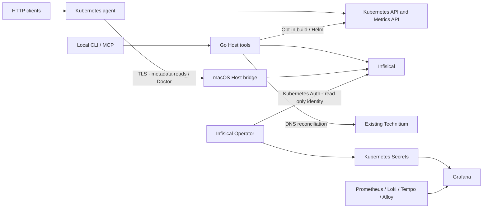

# KuchDesk

**Go agents for operating Kubernetes from a macOS host, with observability and scoped secret access.**

KuchDesk connects host diagnostics and deployment tools to a Kubernetes resource API. It brings cluster discovery, bounded operations, Infisical access and Grafana observability into one repository. Use HTTP, local CLI commands or MCP tools to inspect a cluster and carry out explicitly enabled operations.

The supported host workflow is macOS. The checked-in lab runs on Docker Desktop Kubernetes with KIND nodes; the cluster agent and Helm chart also support other compatible Kubernetes installations. The KuchDesk dashboard is not included.

[Quickstart](#quickstart) · [Architecture](#architecture) · [Capabilities](#capabilities) · [Configuration](#configuration-and-reload) · [Documentation](#repository-and-documentation)

## What it provides

- **Cluster visibility:** Kubernetes resources, CPU/memory metrics, events, service relationships and a reconnecting SSE stream.
- **Controlled operations:** authenticated resource and workload APIs, local CLI/MCP tools, dry runs, confirmation checks and resource-version conflict protection.
- **Host diagnostics and delivery:** read-only Doctor reports, Technitium wildcard DNS reconciliation, and opt-in image build/push/Helm deployment workflows.
- **Scoped Infisical access:** explicit human Admin login, Host project administration, a separate read-only Kubernetes identity, and continuous project-access reconciliation.
- **Observability:** Grafana, Prometheus, Loki, Tempo and Alloy, plus image rendering and k6 Operator in the local deployment profile.

## Architecture


```mermaid
flowchart LR
    Client[HTTP clients] --> Agent[Kubernetes agent]
    Agent --> API[Kubernetes API and Metrics API]
    Agent -->|TLS · metadata reads / Doctor| Bridge[macOS Host bridge]
    CLI[Local CLI / MCP] --> Host[Go Host tools]
    Host --> Infisical[Infisical]
    Bridge --> Infisical
    Host -->|DNS reconciliation| DNS[Existing Technitium]
    Host -->|Opt-in build / Helm| API
    Operator[Infisical Operator] -->|Kubernetes Auth · read-only identity| Infisical
    Operator --> Secret[Kubernetes Secrets]
    Secret --> Grafana[Grafana]
    Telemetry[Prometheus / Loki / Tempo / Alloy] --> Grafana
```

The cluster agent runs once per cluster behind an internal Service. It uses `client-go` watches and the Metrics API rather than connecting directly to every node. The macOS side contains a periodic DNS job, separate CLI/MCP processes and an opt-in HTTPS bridge. It keeps the Infisical bootstrap credential on the Host; the Kubernetes agent does not receive it.

**Host Admin and Kubernetes read-only describe Infisical permissions.** Kubernetes API permissions are configured separately: the chart defaults to read-only discovery, while general management requires explicit enablement and the chart's `cluster-admin` binding. The network bridge permits metadata reads; administrative Infisical operations use the separately scoped local CLI/MCP.

## Quickstart

### Prerequisites

| Workflow | Requirements |
|---|---|
| Build and test all Go modules | Go **1.26+**; the Host module declares Go 1.25 and the cluster module Go 1.26 |
| Cluster agent | Reachable Kubernetes cluster, `kubectl`, Helm, an agent image available to its runtime, and a bearer Secret provisioned through your secret workflow |
| Resource CPU/memory metrics | Working Kubernetes Metrics API, usually provided by metrics-server |
| Host DNS installation | macOS, `kubectl`, an existing healthy Technitium Service and permission to read its admin Secret |
| Local observability profile | Docker Desktop Kubernetes/KIND and the DNS, ingress, TLS, storage and Infisical prerequisites in the [lab guide](lab/README.md#prerequisites) |

Run the following from the repository root. Building and rendering do not install services:

```sh
mkdir -p .kuchdesk/bin
go -C host-agent build -o "$PWD/.kuchdesk/bin/kuchdesk-host-agent" ./cmd/kuchdesk-host-agent
go -C kuchdesk-agent build ./...

helm lint kuchdesk-agent/chart \
  --set cluster.id=example --set cluster.name='Example cluster' \
  --set image.repository=example.invalid/kuchdesk-agent --set image.tag=0.10.0
helm template kuchdesk-agent kuchdesk-agent/chart \
  --set cluster.id=example --set cluster.name='Example cluster' \
  --set image.repository=example.invalid/kuchdesk-agent --set image.tag=0.10.0
```

The example image is a render-only placeholder. To install, build/publish an image available to your cluster and follow the [Helm chart guide](kuchdesk-agent/chart/README.md). Select a unique cluster ID and review its authentication and RBAC settings. The agent has no public hostname by default.

### Check the Host, then choose a workflow

Preview the DNS target without changing Technitium:

```sh
.kuchdesk/bin/kuchdesk-host-agent \
  -kube-context "$(kubectl config current-context)" \
  -zone example.test -check-target
```

For periodic DNS reconciliation, use the [macOS installation instructions](host-agent/README.md). The installer records the selected context and absolute `kubectl` path; the job updates the configured wildcard answer and does not configure system DNS or routing.

For diagnostics, this command uses the checked-in local profile. Substitute your
own domain, context and registry address for another installation:

```sh
go -C host-agent run ./cmd/kuchdesk-doctor \
  -domain infisical.local.dev -kube-context docker-desktop \
  -registry-url http://127.0.0.1:5001 -disk-path "$PWD"
```

For Infisical human login, first configure the site's host in `lab/site.json` and provision the existing private enrollment policy/state through the [hybrid setup guide](docs/infisical-hybrid-control.md). With the controller stopped, run:

```sh
export KUCHDESK_PROJECT_ROOT="$PWD"
"$KUCHDESK_PROJECT_ROOT/.kuchdesk/bin/kuchdesk-host-agent" admin-login
```

The installed command also works outside the checkout when `KUCHDESK_PROJECT_ROOT` remains set. It opens the official login page and supports hidden terminal paste recovery. Ordinary DNS or daemon startup never prompts for human login. See [login and authority verification](docs/infisical-human-login.md) for prerequisites, recovery and status; browser completion alone does not prove validated authority.

## Capabilities

| Area | Implemented behavior | Verification and limits |
|---|---|---|
| Kubernetes HTTP/SSE API | Discovery, snapshots, events, metrics and opt-in management | Local discovery and authenticated reads verified; individual write paths have different live coverage |
| CLI and MCP | Infisical metadata/management, Doctor, deployment planning and opt-in execution | Shared Go services with command/protocol tests; tools and write access depend on selected scope |
| Async operations | Start/status/cancel for supported listing, deployment and workload operations | Bounded in-memory jobs; cancellation and conflicts tested; restart loses history and cancellation cannot undo an accepted mutation |
| Doctor | Read-only checks, structured findings, MCP repair prompt and typed plan validation | Live checks and fixture tests; validation is not permission to execute a repair |
| Infisical control | Explicit Admin login, Host/K8 role separation and repeated access reconciliation | Local activation, viewer write denial, refresh, restart recovery and automatic enrollment of a disposable new project verified without restart or manual grants |
| Grafana and secret sync | Operator supplies native Kubernetes Secrets; Grafana uses the configured secret | Local Kubernetes Auth sync and Grafana readiness verified; sync does not imply all consumers automatically reload |
| Dashboard / cluster topology | Dashboard absent; KIND node-count management not implemented | Neither is part of the current agent interface |

The [capability inventory](docs/agent-capabilities.md) records per-feature coverage. For newer command, reload and activation evidence, use the dated [verification report](docs/agent-verification-2026-10-10.md). These are installation snapshots, not guarantees about another cluster.

## Configuration and reload

| Change | How it takes effect |
|---|---|
| Project display metadata in `.env` | Re-read on CLI invocation and MCP capabilities calls; nonempty process environment takes precedence |
| Enrollment project policy | Restrictions apply on requests; new access requires successful reconciliation; write authorization rechecks current policy |
| Reconciliation interval | Re-read during the active wait at bounded one-second intervals; backoff and server Retry-After remain enforced |
| Identity/organization/version binding, credentials or process settings | Restart required; changed enrollment bindings fail closed and may require state migration |
| Cluster agent Helm settings | Helm upgrade and Pod rollout |
| Site DNS/TLS/host settings | Validate, plan and apply the local profile, then render/review/deploy affected resources; no blanket service hot reload |
| Operator-synced Secret | Native Secret updates; environment-based consumers need rollout, while volume consumers need application reload support |

See the [detailed restart matrix](docs/agent-verification-2026-10-10.md#restart-matrix). Credentials belong in the documented private backend or Kubernetes Secret workflow, never in Git, Helm literal values or chat. [`.env.example`](.env.example) contains placeholders only.

## Repository and documentation

| Path / guide | Contents |
|---|---|
| [`kuchdesk-agent/`](kuchdesk-agent/README.md) | Cluster resource model, HTTP/SSE contracts, management boundaries and tests |
| [`kuchdesk-agent/chart/`](kuchdesk-agent/chart/README.md) | Portable Helm installation and opt-in RBAC/features |
| [`host-agent/`](host-agent/README.md) | macOS installation, Go CLI/MCP tools, Doctor and deployment profiles |
| [`lab/`](lab/README.md) | Site renderer and local observability/HTTPS/Infisical deployment profile |
| [Host control plane](docs/host-control-plane.md) | Host bridge transport and command boundaries |
| [Hybrid Infisical control](docs/infisical-hybrid-control.md) | Human authority, machine identities, policy and reconciliation |
| [Human login](docs/infisical-human-login.md) | Built-in `admin-login`, hidden fallback and sanitized authority checks |
| [Observability audit](docs/infisical-observability-audit-2026-10-10.md) | Dated service readiness and telemetry evidence |
| [Changelog](CHANGELOG.md) | Release history and externally relevant changes |

The `lab/` profile contains installation-specific values; agent binaries do not inherit its hostnames or Kubernetes context. Technitium is separately managed. Shared application databases and unrelated home-lab services remain outside this repository's scope.

## Verify locally

```sh
go -C kuchdesk-agent test ./...
go -C kuchdesk-agent vet ./...
go -C host-agent test -race ./...
go -C host-agent vet ./...
go -C lab test ./...
```

Tests use mocks, temporary resources and contract fixtures where appropriate. Passing them does not replace live acceptance checks for credentials, RBAC, storage, network reachability or rollout health.
