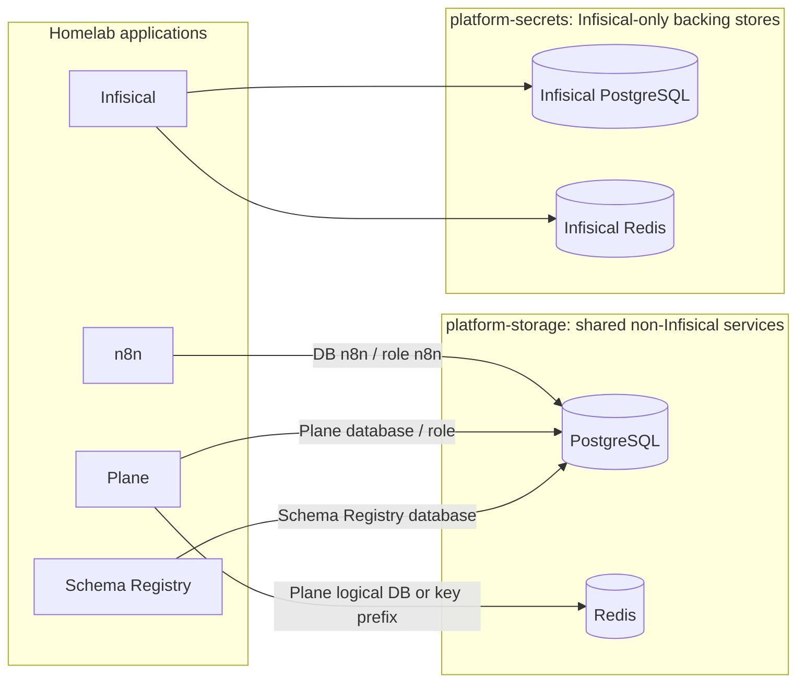

# Shared PostgreSQL and Redis topology

## Rule

Run one shared PostgreSQL service and one shared Redis service for the
homelab's non-Infisical applications. Application charts must connect to
`postgresql.platform-storage.svc.cluster.local:5432` and
`redis.platform-storage.svc.cluster.local:6379`; they must not deploy their
own PostgreSQL or Redis StatefulSets, Services, or PVCs.

Infisical is the sole exception. Its dedicated PostgreSQL and Redis stay in
`platform-secrets` so the secrets service's backing data remains an isolated
recovery boundary. Other applications must not use Infisical's backing stores.

"Shared" means a shared server/service deployment, not that every application
must write into the same PostgreSQL schema or Redis keyspace. Use a
service-specific PostgreSQL database and role, and a Redis logical database or
key prefix when the client supports it. These are logical boundaries on the
shared services, not separate database/cache deployments. Keep connection
credentials in Infisical and use only service DNS names in chart values.

The current Docker Desktop Redis profile has authentication disabled and
keeps the service cluster-internal. Redis database numbers or key prefixes are
namespaces, not security boundaries; do not treat them as per-app authorization.
Enable Redis ACLs with service-specific credentials before exposing Redis
outside the cluster or relying on Redis for mutually untrusted workloads.

This rule covers PostgreSQL and Redis only. MongoDB, RabbitMQ, NATS, Kafka,
MinIO, and other purpose-specific stores remain separate services where
required by their consumers.

## Topology

## Repository configuration and rollout gate

- n8n already points to the shared PostgreSQL Service and uses its own `n8n`
  database and role.
- Schema Registry is configured against the `platform-storage` PostgreSQL
  Service.
- Plane is configured with the chart's bundled PostgreSQL and Redis disabled;
  its `DATABASE_URL` and `REDIS_URL` come from its Infisical-synced app/live
  secrets and must target the shared services.
- Infisical retains its own PostgreSQL manifest and chart-managed Redis in
  `platform-secrets`.

The shared PostgreSQL instance should grant each application only its own
database and role. For example, n8n retains its `n8n` database/role, while
Plane uses its own logical database and role on the same PostgreSQL server.

Do not apply the Plane change until its current database has been backed up and
migrated into the shared PostgreSQL instance, and its Infisical-managed
connection URLs have been checked without printing credentials. Turning off
Plane's local services before migration would leave existing Plane data
unavailable. This document and checked-in chart values describe the target;
they do not claim the running cluster has already been changed.
