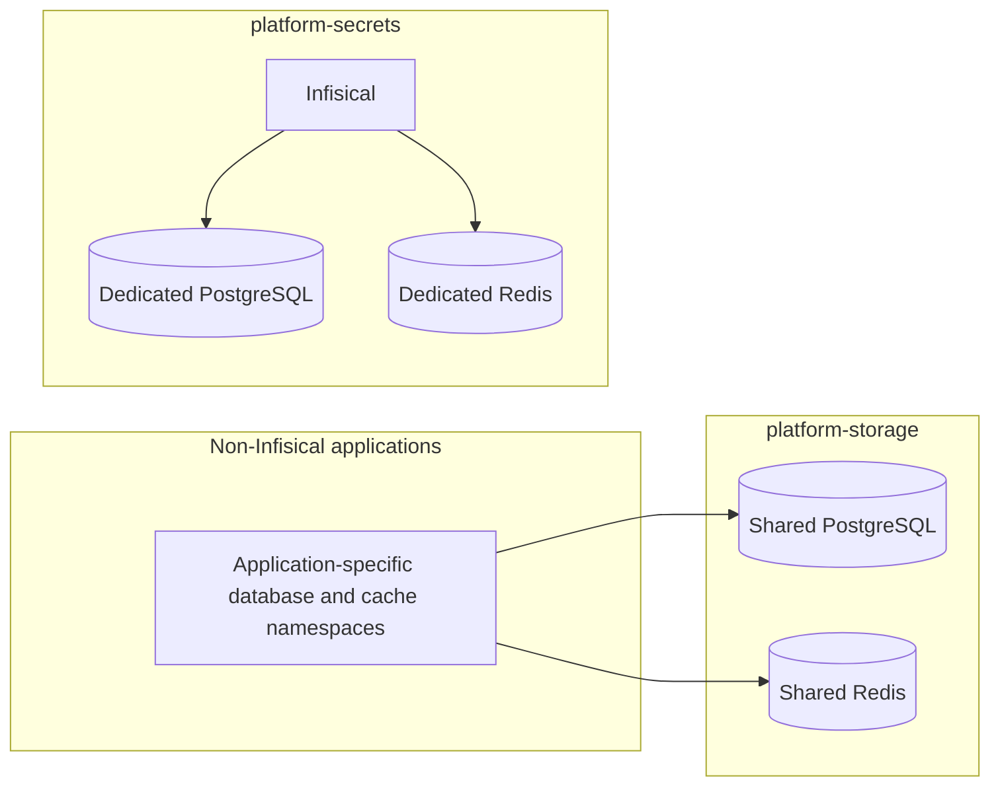

# Shared PostgreSQL and Redis topology

## Rule

Run one shared PostgreSQL service and one shared Redis service for the
homelab's non-Infisical applications. Application charts connect to
`postgresql.platform-storage.svc.cluster.local:5432` and
`redis.platform-storage.svc.cluster.local:6379`; they must not deploy their
own PostgreSQL or Redis StatefulSets, Services, or PVCs.

Infisical is the sole exception. Its dedicated PostgreSQL and Redis stay in
`platform-secrets` as an isolated recovery boundary. Other applications must
not use Infisical's backing stores.

Each application gets a service-specific PostgreSQL database and role, plus a
Redis logical database or key prefix when supported. These are logical
boundaries on shared servers, not separate database or cache deployments.
Store connection credentials in Infisical and use Kubernetes service DNS in
application configuration.

The Docker Desktop Redis profile is cluster-internal and has authentication
disabled. Redis database numbers and key prefixes are namespaces, not security
boundaries. Enable Redis ACLs with service-specific credentials before
exposing Redis outside the cluster or using it across mutually untrusted apps.

This policy covers PostgreSQL and Redis. MongoDB, RabbitMQ, NATS, Kafka,
MinIO, and other purpose-specific stores remain separate when required by
their consumers.

## Topology

## Configuration status

The platform storage chart owns the shared PostgreSQL and Redis services.
Infisical retains its separate PostgreSQL and Redis in `platform-secrets`.
Any future non-Infisical service must use the shared endpoints, request its
own database and role, and keep credentials in its service-specific Infisical
path. This describes the project contract; verify live consumers before
claiming that a service is connected.
